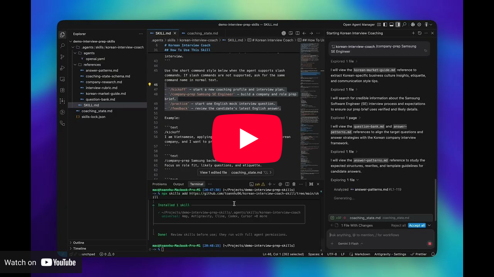

# Korean Interview Coach

`korean-interview-coach`는 한국 기업 면접을 준비하는 베트남 지원자와 외국인 구직자를 위해 만들어진 AI 스킬입니다.

🌐 **웹사이트:** [Korean Interview Coach](https://korean-interview-coach-skill.vercel.app/)

📺 **데모 비디오:**

[](https://www.youtube.com/watch?v=25POtnE5rvQ)

언어: [English](README.md) | [Tiếng Việt](README-vi.md) | [한국어](README-ko.md)

## 저장소 구조

```text
korean-interview-coach-skill/
├── skill/                  # 이식 가능한 Agent Skill 패키지
│   ├── SKILL.md            # 메인 스킬 지침
│   ├── agents/openai.yaml  # 에이전트 메타데이터
│   ├── references/         # 리서치, 평가 루브릭, 질문 은행, 답변 패턴
├── README.md
├── README-vi.md
└── README-ko.md
```

## 스킬 흐름

핵심 코칭 루프는 다음과 같습니다:

```text
kickoff -> company-prep -> practice -> feedback
```

기본 설정:

- 코칭 및 설명은 베트남어
- 면접 질문 및 답변은 영어
- 유용한 예절 및 직장 상황에만 한국어 사용

## 스킬 설치

`skill/` 폴더에서 설치합니다:

```bash
npx skills add https://github.com/toannhu96/korean-interview-coach-skill/tree/main/skill
```

또는 `skill/` 폴더를 다음과 같은 로컬 skills 디렉토리에 복사합니다:

```text
~/.codex/skills/korean-interview-coach
.agents/skills/korean-interview-coach
```

## 예시 프롬프트

```text
$korean-interview-coach /kickoff I want to prepare for a Samsung Software Engineer interview
```
